# 简介

DOT 语言是一种文本图形描述语言。它提供了一种简单的描述图形的方法，并且可以为人类和计算机程序所理解。

Graphviz (Graph Visualization Software) 是一个由 AT&T 实验室开源的工具包，用于绘制 DOT 语言脚本描述的图形。

Graphviz 除了用 DOT 语言用于描述图像，还有许多渲染生成工具，被称为布局器：

- dot，默认布局，主要用于有向图；
- neato，用于“spring model”布局；
- circo，圆环布局；
- twopi，径向布局；
- fdp，用于无向图；
- sfdp，用于需要放大到很大尺寸的无向图；
- osage，紧凑集群布局。

dot 的命令如下所示：

```
dot -Tv -Kv -O example.dot
```

其中 `-Tv` 中的 `v` 表示 Graphviz 支持的输出格式，包括 bmp、png、gif、ico、jpg、jpeg、svg、pdf、ps 等；`-Kv` 中的 `v` 表示布局器，当使用 dot 布局时可以省略该参数；`-O` 表示自动根据输入文件名来给输出文件命名。

---

# 正文

## 基础

DOT 中只有图 `graph`、结点 `node` 和连线 `edge` 三种主要结构。其中图分为有向图和无向图，无向图声明的时候使用关键字 `graph`，有向图使用 `digraph`。

## 关键字

- `node`：定义全局结点属性时使用；
- `edge`：定义全局连线属性时使用；
- `graph`：定义全局图属性，或声明一个无向图时使用；
- `digraph`：声明一个有向图时使用；
- `subgraph`：声明一个子图时使用；
- `strict`：用于防止相同的两个结点间使用重复的连线。

## 注释

DOT 语言支持类似 C 语言的注释，单行注释使用 `//`，多行或部分注释使用 `/*` 和 `*/`。

## 图的定义

DOT 语言内定义图，主要有三部分：图类型的声明、图的名称和图的具体内容。

```bnf
graph : [*strict*] (*graph* | *digraph*) [ID] '{' stmt_list '}'
```

`[strict] (graph | digraph)` 是对图类型的定义， `graph` 用于定义一般由点和线段组成的无向图，而 `digraph` 则用于定义有向图。 `strict` 是可选的，用于限制是否启用严格的语法，可以用来防止两节点间重复连线。

`[ID]` 是对图名称的声明，一般由描述该图的名称的英文表示。

`'{' stmt_list '}'` 是图的具体内容，由一段被英文花括号包裹的语句列表组成。语句列表的定义如下：

```bnf
stmt_list : [ stmt [';'] stmt_list ]
```

上述的定义是递归定义，简单的理解就是 `stmt_list` 是由多个 `stmt` 组成的，多个 `stmt` 之间使用英文分号分隔。

```bnf
stmt : node_stmt | edge_stmt | attr_stmt | ID '=' ID | subgraph
attr_stmt : (*graph* | *node* | *edge*) attr_list
edge_stmt : (node_id | subgraph) edgeRHS [ attr_list ]
node_stmt : node_id [ attr_list ]
```

## ID 标志符

ID 标志符主要用作图和结点的命名字符串。它的命名规则如下：

1. 英文字母 `[a-zA-Z\200-\377]`，下划线 `_`，数字 `[0-9]`（但不能以数字作为开头）；
2. 纯数字 `[-]?(.[0-9]+|[0-9]+(.[0-9]*)?)`；
3. 双引号包裹的字符串 `"..."`，如果字符串中要使用双引号需要使用转义字符 `\"`；
4. 尖括号包裹的 HTML 字符串。

简单的 DOT 代码中的图名 ID 可以省略，这种图成为匿名图。

**子图 ID 一定要以 `cluster` 开头**，否则 graphviz 不识别。

```dot
digraph a {
    subgraph cluster_b {
        ...
    }
    ...
}
```

父图 ID 与子图 ID 共享相同的命名空间，因此父图和子图的 ID 不能相同。

## 结点表达式

结点可以不声明直接在连线声明时使用。

一般有两种情况需要提前声明结点：

一，为结点添加属性：

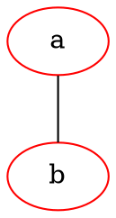

二，将结点分配到子图中：

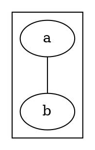

## 连线表达式

连线表达式需要连接两个结点。对于有向图，连线使用 `->`；无向图使用 `--`。

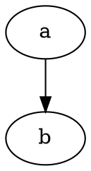

顺序连接多个结点时可以简写为：

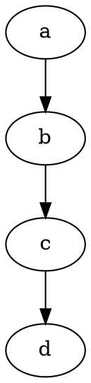

一个结点连接到多个结点时可以简写为：

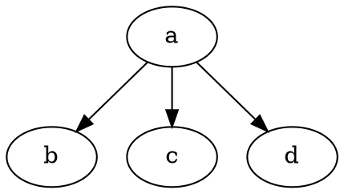

## 属性表达式

属性定义可以给图、结点、连线渲染上不同的样式。属性表达式以键值对 `attr = val` 的形式出现，如果 `val` 中包含 DOT 无法直接解析的字符，必须使用双引号或尖括号包裹。

### 全局属性

#### 图

直接定义：

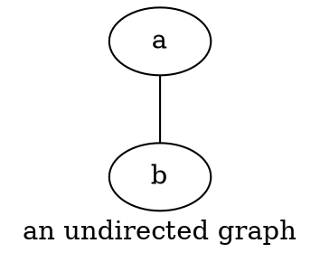

使用 `graph` 关键字：


#### 结点

使用 `node` 关键字：

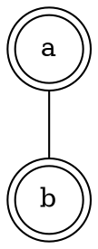

#### 连线

使用 `edge` 关键字：

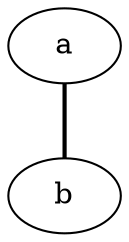

### 局部属性

局部属性可以对某几个结点或连线单独设置属性。

#### 结点

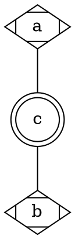

#### 连线

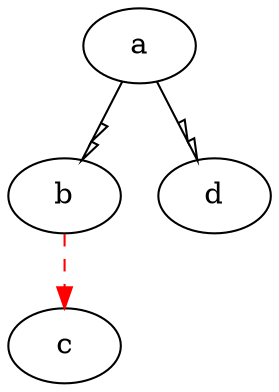

### 常用属性

#### label

用于设置图、结点和连线的名称。

#### shape

用于设置结点的形状。

常用属性值：`box` 矩形、`circle` 圆形、`ellipse` 椭圆形、`diamond` 菱形、`point` 点、`triangle` 三角形、`plaintext` 纯文本。

特殊属性值：`record` 记录表，记录表的样式是根据 `label` 中填充的值决定的，例如 `"A | B | C"` 是从左到右的三个字段，`|` 会绘制成分隔线；`"{A | B | C}"` 是从上到下的三个字段。

更多形状可以参考 [官方文档](https://www.graphviz.org/doc/info/shapes.html)。

#### style

用于设置结点和连线的样式。

常用属性值：`filled` 填充结点颜色、`rounded` 结点角变为圆角、`invis` 不进行绘制、`dashed` 结点边线或连线变为虚线、`dotted` 结点边线或连线表为点线、`solid` 结点边线或连线正常粗细、`bold` 结点边线或连线变粗。

更多样式可以参考 [官方文档](https://www.graphviz.org/docs/attr-types/style/)。

#### color

用于设置结点边框线和连线的颜色。

属性值可以为 RGB 字符串或者 HSV 字符串或者颜色名的形式，支持的颜色名可以参考 [官方文档](https://www.graphviz.org/doc/info/colors.html)。

#### bgcolor

用于设置图的背景色。

#### fillcolor

用于设置结点的背景色。

#### fontname

用于设置图、结点和连线的 ID 标志符的字体。

#### fontsize

用于设置图、结点和连线的 ID 标志符的字体大小。

#### fontcolor

用于设置图、结点和连线的 ID 标志符的字体颜色。

#### rankdir

用于设置图的绘制方向。

常用属性值：`TB` 由上至下、`BT` 由下至上、`LR` 由左至右、`RL` 由右至左。

#### dir

用于设置连线的箭头方向。

常用属性值：`forward` 前向（有向图默认）、`back` 后向、`both` 双向、`none` （无向图默认）。

#### arrowhead

用于设置连线的头部箭头形状。

常用属性值：`normal` 实心三角、`empty` 空心三角、`inv` 实心倒三角、`invempty` 空心倒三角、`dot` 实心圆点、`odot` 空心圆点、`none` 无、`diamond` 实心菱形、`odiamond` 空心菱形、`box` 实心矩形、`obox` 空心矩形。

更多形状可以参考 [官方文档](https://www.graphviz.org/docs/attr-types/arrowType/)。

#### arrowtail

用于设置连线的尾部箭头形状。

#### arrowsize

用于设置连线的箭头大小。

#### 更多属性

可以参考 [官方文档](https://www.graphviz.org/doc/info/attrs.html)。

## 锚点

### 方位锚点

每个结点都有八个方位：北（`n`）、东北（`ne`）、东（`e`）、东南（`se`）、南（`s`）、西南（`sw`）、西（`w`）、西北（`nw`）。

例如：

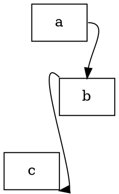

### 命名锚点

一般在使用记录表式结点时，对结点内分组的单元进行命名，例如：

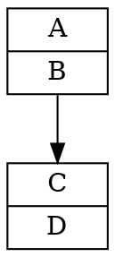

---

# 引用

- [DOT Language](https://www.graphviz.org/doc/info/lang.html)
